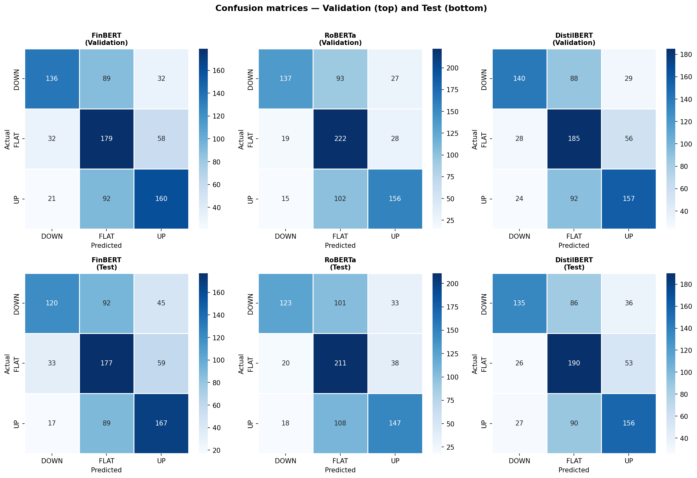
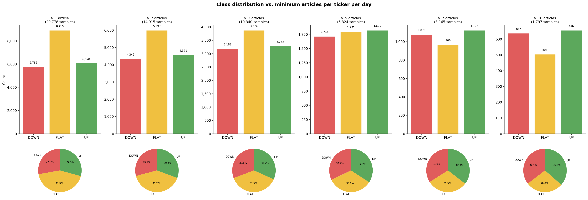

# Stock Nowcasting

A remake of a project developed during my Master in Quantitative Finance. The goal is to use machine learning to explain the relationship between financial news headlines and daily price movements — specifically, to predict whether a stock went **UP**, stayed **FLAT**, or went **DOWN** on the same day the news was published (*nowcasting*).

The original project can be found in my [Text Mining](https://github.com/MarcoPace00/TextMining) repository.

---

## Project Structure

```
STOCK_NOWCASTING/
│
├── 0_fetch_sp500_news.py          # Pull news headlines from the Finnhub API
├── 1_price_var.py                 # Add price variation columns via yfinance
├── 2_distribution.py              # Visualize class distribution across thresholds
├── 3_build_dataset.py             # Build the final training dataset
├── 4_train_evaluate_models.py     # Train, validate and test the models
│
├── sp500_news.csv                 # Raw news data
├── sp500_news_with_prices.csv     # News enriched with price variation
├── sp500_final_dataset.csv        # Final dataset ready for modelling
│
├── Price_var_distribution/
│   └── class_distribution.png    # Class distribution plot
│
└── model_results/
    ├── confusion_matrices.png     # Confusion matrices for all models
    ├── model_summary.csv          # Validation F1 scores summary
    └── Training_evalution_output.txt
```

---

## Pipeline

### 1. Data Collection (`0_fetch_sp500_news.py` + `1_price_var.py`)
The first two scripts pull all the data needed for the project. News headlines for all S&P 500 stocks over the last 3 months are fetched from the **Finnhub API** (free tier), with rate-limit-safe pauses to avoid hitting API restrictions. Price variations (close-to-close) are then retrieved using **yfinance** and appended to the dataset as `price_var`, `prc_var` and `var_class` (−1 / 0 / +1 for DOWN / FLAT / UP, using a ±1% threshold).

### 2. Threshold Analysis (`2_distribution.py`)
A subtle but important issue arises when building the dataset: if a stock has very few headlines on a given day, it is reasonable to assume nothing material happened and those samples would add noise rather than signal. On the other hand, filtering too aggressively would shrink the dataset significantly. To navigate this trade-off, this script visualises the class distribution for multiple article-count thresholds, making it easy to pick a sensible cutoff.

### 3. Dataset Construction (`3_build_dataset.py`)
With a threshold of **5 articles per ticker per day**, this script builds the final dataset. All headlines for a given stock on a given day are concatenated into a single string, which becomes the model input. The corresponding `var_class` is the prediction target.

### 4. Model Training & Evaluation (`4_train_evaluate_models.py`)
Three transformer models are fine-tuned and compared:

| Model | Notes |
|---|---|
| **FinBERT** | BERT pre-trained on financial text |
| **RoBERTa-base** | Robust general-purpose transformer |
| **DistilBERT** | Lightweight and fast |

The dataset is split into **train / validation / test (70/15/15)** with stratification. Models are selected based on **validation F1-macro**, then evaluated once on the held-out test set.

**Best model: RoBERTa**, with impressive precision on the directional classes — **67% on UP** and **76% on DOWN** — a significant improvement over the results of the original project.

---

## Requirements

```bash
pip install finnhub-python yfinance pandas scikit-learn transformers torch accelerate matplotlib seaborn
```

You will also need a free API key from [finnhub.io](https://finnhub.io), which should be set in `0_fetch_sp500_news.py`.

---

## Results



